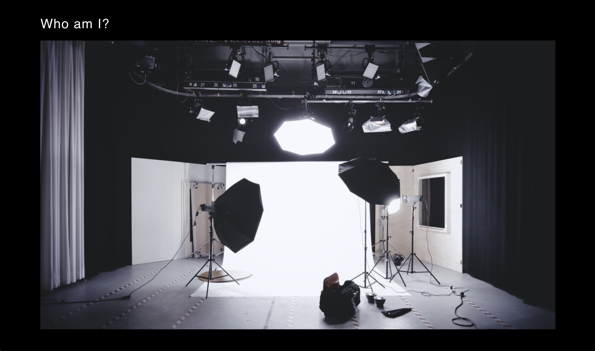

# Photo Port App

## Description

An introduction to React.js this project assignment was created at Rice University to give me the basic introductory skills building my front-end acknowledgement. I learned how to incorporate React.js with HTML/CSS/JavaScript and how to code Modals!

 

     

 

## Link

https://bjennings90.github.io/photo-port/

This project was bootstrapped with Create React App.
